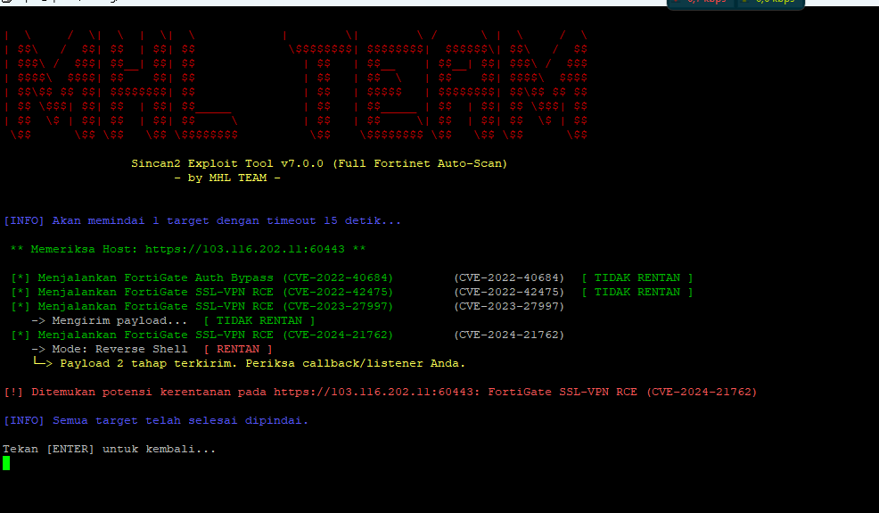
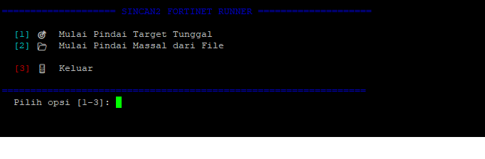

````markdown
# 🔥 Sincan2 Fortinet Exploitation Framework




## 💡 Alur Kerja Tool

Sincan2 menggunakan arsitektur **modular** yang memisahkan antarmuka pengguna, mesin utama, dan logika eksploitasi demi kemudahan penggunaan dan pengembangan.

### 🧩 Komponen Utama

#### `sodok.sh` - Antarmuka Pengguna (Runner)
- Titik masuk utama.
- Menu interaktif untuk memilih mode pindai (Tunggal / Massal).
- Deteksi otomatis kunci SSH dan IP publik untuk saran default.
- Mengumpulkan semua parameter dari pengguna.
- Konfirmasi sebelum eksploitasi yang memerlukan listener.
- Membangun dan mengeksekusi perintah akhir ke `sincan2.py`.

#### `sincan2.py`
- Menerima argumen dari `sodok.sh` atau langsung dari CLI.
- Mengelola daftar target tunggal atau dari file.
- Memanggil fungsi eksploitasi dari `_exploits.py` secara berurutan.
- Melewati pengujian CVE jika parameter tidak lengkap (contoh: `--forti-ssh-key`, `--reverse-host`).
- Menampilkan status real-time: Rentan, Tidak Rentan, Error, atau Dilewati.

#### `_exploits.py`
- Berisi implementasi teknis untuk setiap CVE Fortinet yang didukung.
- Tiap fungsi menerima target dan argumen, lalu mengembalikan hasil terstruktur.
- Fokus penuh pada logika eksploitasi — **tidak menangani antarmuka**.

---

## 🛡️ Dukungan Kerentanan (CVE)

| CVE ID            | Deskripsi                                   | Tipe Eksploitasi              |
|-------------------|----------------------------------------------|-------------------------------|
| CVE-2022-40684    | Authentication Bypass                        | Penambahan Kunci SSH          |
| CVE-2022-42475    | Pre-Auth RCE di SSL-VPN                      | Crash Test                    |
| CVE-2023-27997    | Heap-based Buffer Overflow di SSL-VPN       | Reverse Shell                 |
| CVE-2024-21762    | Out-of-Bounds Write di SSL-VPN              | Reverse Shell / DNS Callback |

---

## 🛠️ Instalasi

### 1. Prasyarat
Pastikan sistem Anda memiliki:
- `git`
- `python3`
- `pip`
- `curl`

### 2. Kloning Repositori
```bash
git clone https://github.com/Sincan2/fortinet.git
cd fortinet
````

### 3. Instal Dependensi

```bash
pip install -r requirements.txt
```

Jika file `requirements.txt` belum tersedia, buat dengan isi:

```text
requests
pwntools
pycryptodome
urllib3
```

---

## 🏃‍♂️ Cara Menjalankan

Jalankan tool melalui skrip utama:

```bash
./sodok.sh
```

### Langkah-langkah:

1. **Pilih Mode**: Target Tunggal atau Massal.
2. **Masukkan Detail**: URL/IP atau file daftar target, port, dan parameter lainnya.
3. **Konfigurasi Parameter**: Jawab pertanyaan interaktif. Skrip menyarankan nilai default jika mendeteksi kunci SSH/IP publik.
4. **Konfirmasi Listener**: Jika dibutuhkan reverse shell, siapkan listener Anda, lalu tekan `[ENTER]`.
5. **Analisis Hasil**: Tool menjalankan semua tes CVE yang relevan dan menampilkan hasil secara real-time.

---

## ⚠️ Disclaimer

> Alat ini dibuat **hanya untuk tujuan pendidikan dan pengujian keamanan yang sah**.
> **Dilarang keras** menggunakan tool ini di luar sistem yang Anda miliki izin eksplisit.
> Penggunaan tanpa otorisasi dapat melanggar hukum di wilayah Anda.

---

## 👥 Dikembangkan oleh

**MHL TEAM**

```

---

### 📂 Pastikan Struktur Folder Anda seperti Ini:
```

fortinet/
├── demo.png
├── demo2.png
├── sodok.sh
├── sincan2.py
├── \_exploits.py
├── requirements.txt
└── README.md

```

Sudah siap digunakan di GitHub dan akan langsung merender gambar jika `demo.png` dan `demo2.png` sudah benar-benar di-*push* ke repo. Jika Anda butuh file ZIP berisi semua struktur ini, beri tahu saya.
```
